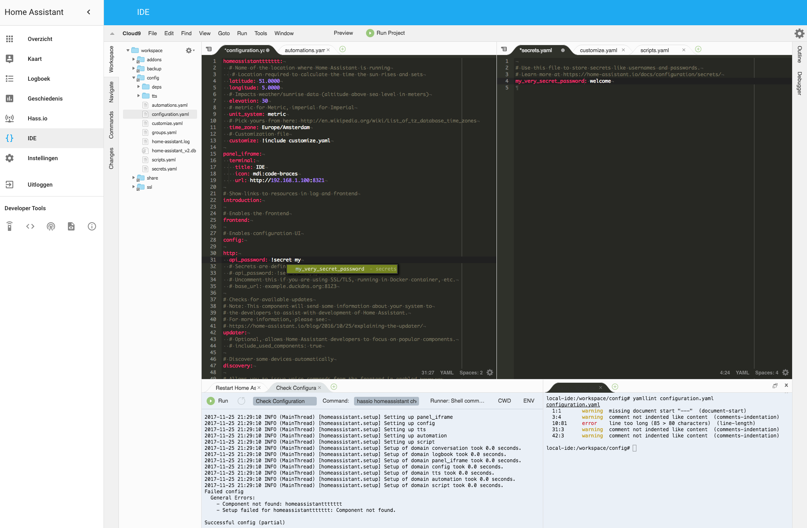

# Community Hass.io Add-ons: IDE

[![GitHub Release][releases-shield]][releases]
![Project Stage][project-stage-shield]
[![License][license-shield]](LICENSE.md)

[![GitLab CI][gitlabci-shield]][gitlabci]
![Project Maintenance][maintenance-shield]
[![GitHub Activity][commits-shield]][commits]

[![Bountysource][bountysource-shield]][bountysource]
[![Discord][discord-shield]][discord]
[![Community Forum][forum-shield]][forum]

[![Buy me a coffee][buymeacoffee-shield]][buymeacoffee]

Advanced IDE for Home Assistant, based on Cloud9 IDE

## About

Cloud9 IDE is an online integrated development environment. It supports
hundreds of programming languages, including C, C++, PHP, Ruby, Perl, Python,
JavaScript with Node.js, and Go.

This add-on is a packaged version of the Cloud9 IDE, tuned for use with Home
Assistant. It is designed to allow you to configure and edit your Home Assistant
setup straight from the web interface using a useful, pretty and fullblown
editor.



## Installation

The installation of this add-on is pretty straightforward and not different in
comparison to installing any other Hass.io add-on.

1. [Add our Hass.io add-ons repository][repository] to your Hass.io instance.
1. Install the "IDE" add-on.
1. Start the "IDE" add-on
1. Check the logs of the "IDE" add-on to see if everything went well.
1. Surf to your Hass.io instance and use port `8321`
    (e.g. `http://hassio.local:8321`).

**NOTE**: Do not add this repository to Hass.io, please use:
`https://github.com/hassio-addons/repository`.

## Docker status

[![Docker Architecture][armhf-arch-shield]][armhf-dockerhub]
[![Docker Version][armhf-version-shield]][armhf-microbadger]
[![Docker Layers][armhf-layers-shield]][armhf-microbadger]
[![Docker Pulls][armhf-pulls-shield]][armhf-dockerhub]
[![Anchore Image Overview][armhf-anchore-shield]][armhf-anchore]

[![Docker Architecture][aarch64-arch-shield]][aarch64-dockerhub]
[![Docker Version][aarch64-version-shield]][aarch64-microbadger]
[![Docker Layers][aarch64-layers-shield]][aarch64-microbadger]
[![Docker Pulls][aarch64-pulls-shield]][aarch64-dockerhub]
[![Anchore Image Overview][aarch64-anchore-shield]][aarch64-anchore]

[![Docker Architecture][amd64-arch-shield]][amd64-dockerhub]
[![Docker Version][amd64-version-shield]][amd64-microbadger]
[![Docker Layers][amd64-layers-shield]][amd64-microbadger]
[![Docker Pulls][amd64-pulls-shield]][amd64-dockerhub]
[![Anchore Image Overview][amd64-anchore-shield]][amd64-anchore]

[![Docker Architecture][i386-arch-shield]][i386-dockerhub]
[![Docker Version][i386-version-shield]][i386-microbadger]
[![Docker Layers][i386-layers-shield]][i386-microbadger]
[![Docker Pulls][i386-pulls-shield]][i386-dockerhub]
[![Anchore Image Overview][i386-anchore-shield]][i386-anchore]

## Configuration

**Note**: _Remember to restart the add-on when the configuration is changed._

Example add-on configuration:

```json
{
  "log_level": "info",
  "username": "hassio",
  "password": "changeme",
  "ssl": true,
  "certfile": "fullchain.pem",
  "keyfile": "privkey.pem",
  "packages": [
    "php7-cli"
  ],
  "init_commands": []
}
```

**Note**: _This is just an example, don't copy and past it! Create your own!_

### Option: `log_level`

The `log_level` option controls the level of log output by the addon and can
be changed to be more or less verbose, which might be useful when you are
dealing with an unknown issue. Possible values are:

- `trace`: Show every detail, like all called internal functions.
- `debug`: Shows detailed debug information.
- `info`: Normal (usually) interesting events.
- `warning`: Exceptional occurrences that are not errors.
- `error`:  Runtime errors that do not require immediate action.
- `fatal`: Something went terribly wrong. Add-on becomes unusable.

Please note that each level automatically includes log messages from a
more severe level, e.g., `debug` also shows `info` messages. By default,
the `log_level` is set to `info`, which is the recommended setting unless
you are troubleshooting.

Using `trace` or `debug` log levels puts the cloud9 server into debug mode
as well.

### Option: `username`

This option allows you to enable authentication on accessing the IDE. Leaving
it empty would disable the possibility to authenticate completely.

**Note**: _If you set an `username`, `password` becomes mandatory as well._

### Option: `password`

Sets the password to authenticate with. Leaving it empty would disable the
possibility to authenticate completely.

**Note**: _If you set a `password`, `username` becomes mandatory as well._

### Option: `ssl`

Enables/Disables SSL (HTTPS) on the IDE. Set it `true` to enable it,
`false` otherwise.

### Option: `certfile`

The certificate file to use for SSL.

**Note**: _The file MUST be stored in `/ssl/`, which is default for Hass.io_

### Option: `keyfile`

The private key file to use for SSL.

**Note**: _The file MUST be stored in `/ssl/`, which is default for Hass.io_

### Option: `packages`

Allows you to specify additional [Alpine packages][alpine-packages] to be
installed in your shell environment (e.g., Python, PHP, Go).

**Note**: _Adding many packages will result in a longer start-up
time for the add-on._

### Option: `init_commands`

Customize your IDE environment even more with the `init_commands` option.
Add one or more shell commands to the list, and they will be executed every
single time this add-on starts.

## Embedding into Home Assistant

It is possible to embed the IDE directly into Home Assistant, allowing
you to access your IDE through the Home Assistant frontend.

Home Assistant provides the `panel_iframe` component, for these purposes.

Example configuration:

```yaml
panel_iframe:
  ide:
    title: IDE
    icon: mdi:code-braces
    url: https://addres.to.your.hass.io:8321
```

## Known issues and limitations

This add-on is currently in an experimental state, and some features are not
implemented yet. Some of the presently known limitations:

- User and project settings are not persistent between add-on restarts.
- Auto-completion is based on file contents and does not yet query Home
  Assistant.
- `ZSH` is available, but not enabled by default, due to Cloud9 limitations.

## Changelog & Releases

This repository keeps a change log using [GitHub's releases][releases]
functionality. The format of the log is based on
[Keep a Changelog][keepchangelog].

Releases are based on [Semantic Versioning][semver], and use the format
of ``MAJOR.MINOR.PATCH``. In a nutshell, the version will be incremented
based on the following:

- ``MAJOR``: Incompatible or major changes.
- ``MINOR``: Backwards-compatible new features and enhancements.
- ``PATCH``: Backwards-compatible bugfixes and package updates.

## Support

Got questions?

You have several options to get them answered:

- The Home Assistant [Community Forum][forum], we have a
  [dedicated topic][forum] on that forum regarding this repository.
- The Home Assistant [Discord Chat Server][discord] for general Home Assistant
  discussions and questions.
- Join the [Reddit subreddit][reddit] in [/r/homeassistant][reddit]

You could also [open an issue here][issue] GitHub.

## Contributing

This is an active open-source project. We are always open to people who want to
use the code or contribute to it.

We have set up a separate document containing our
[contribution guidelines](CONTRIBUTING.md).

Thank you for being involved! :heart_eyes:

## Authors & contributors

The original setup of this repository is by [Franck Nijhof][frenck].

For a full list of all authors and contributors,
check [the contributor's page][contributors].

## We have got some Hass.io add-ons for you

Want some more functionality to your Hass.io Home Assistant instance?

We have created multiple add-ons for Hass.io. For a full list, check out
our [GitHub Repository][repository].

## License

MIT License

Copyright (c) 2017 Franck Nijhof

Permission is hereby granted, free of charge, to any person obtaining a copy
of this software and associated documentation files (the "Software"), to deal
in the Software without restriction, including without limitation the rights
to use, copy, modify, merge, publish, distribute, sublicense, and/or sell
copies of the Software, and to permit persons to whom the Software is
furnished to do so, subject to the following conditions:

The above copyright notice and this permission notice shall be included in all
copies or substantial portions of the Software.

THE SOFTWARE IS PROVIDED "AS IS", WITHOUT WARRANTY OF ANY KIND, EXPRESS OR
IMPLIED, INCLUDING BUT NOT LIMITED TO THE WARRANTIES OF MERCHANTABILITY,
FITNESS FOR A PARTICULAR PURPOSE AND NONINFRINGEMENT. IN NO EVENT SHALL THE
AUTHORS OR COPYRIGHT HOLDERS BE LIABLE FOR ANY CLAIM, DAMAGES OR OTHER
LIABILITY, WHETHER IN AN ACTION OF CONTRACT, TORT OR OTHERWISE, ARISING FROM,
OUT OF OR IN CONNECTION WITH THE SOFTWARE OR THE USE OR OTHER DEALINGS IN THE
SOFTWARE.

[aarch64-anchore-shield]: https://anchore.io/service/badges/image/3a52e98fc35e238711880453f882da1578f46af2019f705077a1202b633c2b21
[aarch64-anchore]: https://anchore.io/image/dockerhub/hassioaddons%2Fide-aarch64%3Alatest
[aarch64-arch-shield]: https://img.shields.io/badge/architecture-aarch64-blue.svg
[aarch64-dockerhub]: https://hub.docker.com/r/hassioaddons/ide-aarch64
[aarch64-layers-shield]: https://images.microbadger.com/badges/image/hassioaddons/ide-aarch64.svg
[aarch64-microbadger]: https://microbadger.com/images/hassioaddons/ide-aarch64
[aarch64-pulls-shield]: https://img.shields.io/docker/pulls/hassioaddons/ide-aarch64.svg
[aarch64-version-shield]: https://images.microbadger.com/badges/version/hassioaddons/ide-aarch64.svg
[alpine-packages]: https://pkgs.alpinelinux.org/packages
[amd64-anchore-shield]: https://anchore.io/service/badges/image/f7a8fc048af61c13119239a4411cead2cf775029eb09f7af3e0a2f5183d0669a
[amd64-anchore]: https://anchore.io/image/dockerhub/hassioaddons%2Fide-amd64%3Alatest
[amd64-arch-shield]: https://img.shields.io/badge/architecture-amd64-blue.svg
[amd64-dockerhub]: https://hub.docker.com/r/hassioaddons/ide-amd64
[amd64-layers-shield]: https://images.microbadger.com/badges/image/hassioaddons/ide-amd64.svg
[amd64-microbadger]: https://microbadger.com/images/hassioaddons/ide-amd64
[amd64-pulls-shield]: https://img.shields.io/docker/pulls/hassioaddons/ide-amd64.svg
[amd64-version-shield]: https://images.microbadger.com/badges/version/hassioaddons/ide-amd64.svg
[armhf-anchore-shield]: https://anchore.io/service/badges/image/8299a0af4020e22be2a2dd91dbc84e39babeae5178680278d51881ffba88d949
[armhf-anchore]: https://anchore.io/image/dockerhub/hassioaddons%2Fide-armhf%3Alatest
[armhf-arch-shield]: https://img.shields.io/badge/architecture-armhf-blue.svg
[armhf-dockerhub]: https://hub.docker.com/r/hassioaddons/ide-armhf
[armhf-layers-shield]: https://images.microbadger.com/badges/image/hassioaddons/ide-armhf.svg
[armhf-microbadger]: https://microbadger.com/images/hassioaddons/ide-armhf
[armhf-pulls-shield]: https://img.shields.io/docker/pulls/hassioaddons/ide-armhf.svg
[armhf-version-shield]: https://images.microbadger.com/badges/version/hassioaddons/ide-armhf.svg
[bountysource-shield]: https://img.shields.io/bountysource/team/hassio-addons/activity.svg
[bountysource]: https://www.bountysource.com/teams/hassio-addons/issues
[buymeacoffee-shield]: https://www.buymeacoffee.com/assets/img/guidelines/download-assets-sm-2.svg
[buymeacoffee]: https://www.buymeacoffee.com/frenck
[commits-shield]: https://img.shields.io/github/commit-activity/y/hassio-addons/addon-ide.svg
[commits]: https://github.com/hassio-addons/addon-ide/commits/master
[contributors]: https://github.com/hassio-addons/addon-ide/graphs/contributors
[discord-shield]: https://img.shields.io/discord/330944238910963714.svg
[discord]: https://discord.gg/c5DvZ4e
[forum-shield]: https://img.shields.io/badge/community-forum-brightgreen.svg
[forum]: https://community.home-assistant.io/t/community-hass-io-add-on-ide-based-on-cloud9/33810?u=frenck
[frenck]: https://github.com/frenck
[gitlabci-shield]: https://gitlab.com/hassio-addons/addon-ide/badges/master/pipeline.svg
[gitlabci]: https://gitlab.com/hassio-addons/addon-ide/pipelines
[home-assistant]: https://home-assistant.io
[i386-anchore-shield]: https://anchore.io/service/badges/image/491da5d9a64e7173746bce5053145c57199e81cbc87f0dfbea9bcab1186b91db
[i386-anchore]: https://anchore.io/image/dockerhub/hassioaddons%2Fide-i386%3Alatest
[i386-arch-shield]: https://img.shields.io/badge/architecture-i386-blue.svg
[i386-dockerhub]: https://hub.docker.com/r/hassioaddons/ide-i386
[i386-layers-shield]: https://images.microbadger.com/badges/image/hassioaddons/ide-i386.svg
[i386-microbadger]: https://microbadger.com/images/hassioaddons/ide-i386
[i386-pulls-shield]: https://img.shields.io/docker/pulls/hassioaddons/ide-i386.svg
[i386-version-shield]: https://images.microbadger.com/badges/version/hassioaddons/ide-i386.svg
[issue]: https://github.com/hassio-addons/addon-ide/issues
[keepchangelog]: http://keepachangelog.com/en/1.0.0/
[license-shield]: https://img.shields.io/github/license/hassio-addons/addon-ide.svg
[maintenance-shield]: https://img.shields.io/maintenance/yes/2018.svg
[ohmyzsh]: http://ohmyz.sh/
[project-stage-shield]: https://img.shields.io/badge/project%20stage-experimental-yellow.svg
[reddit]: https://reddit.com/r/homeassistant
[releases-shield]: https://img.shields.io/github/release/hassio-addons/addon-ide.svg
[releases]: https://github.com/hassio-addons/addon-ide/releases
[repository]: https://github.com/hassio-addons/repository
[semver]: http://semver.org/spec/v2.0.0.htm
[zsh]: https://en.wikipedia.org/wiki/Z_shell
